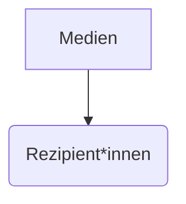
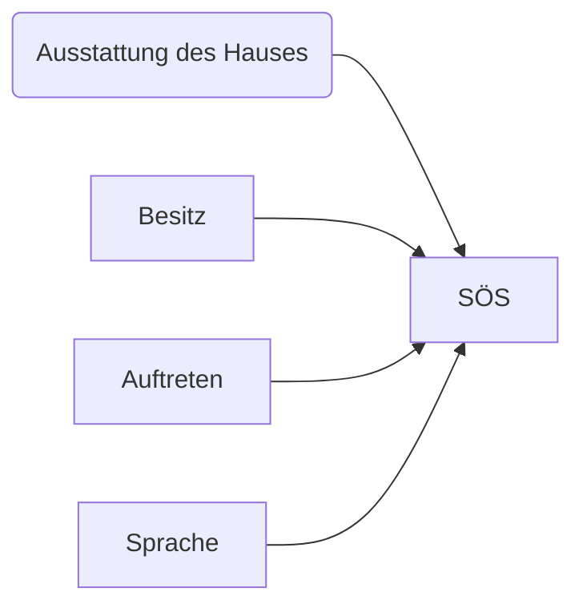
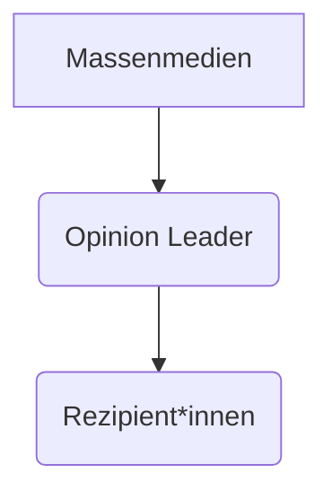

## Grundprobleme sozialwissenschaftlicher Methodologie

### Analyse von Wirkungszusammenhängen oder Die Frage nach dem "Warum"

#### Exkurs: Geschichte der Wahlforschung

* erste Wahlprognosen in den USA, seit den Präsidentschaftswahlen 1824, meist Probeabstimmungen (straw polls)

  * "Wenn du bei der nächsten Wahl republikanisch wählst, geh in die rechte Ecke des Pubs, wenn nicht, geh in die linke Ecke"

* ab Ende des 19 Jhds. Organisieren Zeitungen regelmäßig große Umfragen, z.B. Literary Digest "Glaube an die große Zahl"

* Präsidentschaftswahlkampf 1936: George Horace Gallup gelingt es mit einer neuen Technik (Quotenstichprobe und Hochrechnung) den Sieg Roosevelts vorherzusagen

  * Gallup konnte mit nur kleiner Stichprobenmenge Wahlsieg vorhersagen
  * Fehlschluss von Literary Digest
    * Auto und Telefonbesitzer*innen eher wohlhabende Menschen, damit nicht mehr repräsentativ 

  1. "Literary Digest" prognostiziert den Sieg Landons
     * Postkarten der Zeitschrift beigelegt, eigene Leser*innenschaft wurde aufgefordert die Postkarten ausgefüllt zurückzusenden
     * Verzeichnisse von Automobilbesitzer*innen hergenommen und angeschrieben
     * Durch Telefonverzeichnisse telefoniert
     * 2.4 Millionen Amerikaner*innen wurden kontaktiert
  2. George Gallup prognostiziert den Sieg Roosevelts
     * Stichprobe: nur einige tausende Befragte
     * Auswahl der Befragten nach für die Wahlbevölkerung repräsentativen Kriterien (Stadt/Land, Bildung, ethnische Zugehörigkeit, Geschlecht...)

#### Exkurs: Sampling (Stichprobenziehung)

* Grundgesamtheit: Menge der Personen, für die eine Aussage gelten soll
* Sampling: Verfahren der Ziehung einer Stichprobe
* Stichprobe: Teilmenge von Personen aus der Grundgesamtheit, an denen die Untersuchung durchgeführt wird

#### Exkurs: Kriterium der Repräsentativität

**Strukturäquivalenz zur Grundgesamtheit**

um Aussagen aus einer Stichprobe auf die Grundgesamtheit übertragen (=verallgemeinern) zu können, müssen die wichtigsten Merkmalausprägungen der Grundgesamtheit zu gleichen Teilen auch in der Stichprobe vorkommen, z.B. Alter, Geschlecht, Bildung...

**und**

Es muss sich um eine Zufallsziehung handeln: jedes Element hat die gleiche Chance ausgewählt zu werden 

---

### Lazarsfeld Konsument*innenstudie

Hängt eine Wahlforschungsstudie an (finanziert über die Konsument*innenstudie)

frühere Erfahrungen Lazarsfelds mit:

* Umfrageforschung (Marketingstudien)
  * RAVAG-Studie 1932
  * Leiter des Office of Radio Research
* Medienwirkungsforschung
  * Wirkung von Propagandafilmen auf US Soldaten, die auf den Einsatz vorbereitet werden - "The Battle of Britain"
    * Kampfmoral durch Propaganda stärken

### Sozio-historischer Hintergrund

* Aufkommen moderner Massenkommunikation

  * Radio
  * Presse
  * Werbung
  * politische Propaganda

  Monopolisierung moderner Massenmedien zur "Gleichschaltung" der Gesellschaft im Nazi-Deutschland

* Erste Studien zu den Wirkungen von Kinofilmen 

---

Annahme eines starken, direkten Einflusss der Medien

**Stimulus/Response Modell**

---

### Forschungsleitende Fragestellung

Wie und warum sich Personen für bestimmte Parteien entscheiden

* Welche Faktoren beinflussen das Wahlverhalten
* Einfluss von Rundfunk und Presse auf politische Meinungsbildung und Wahlverhalten
* Meinungswechsel oder -verschiebung
  * Leute bei denen ich das Zustandekommen einer Wahlentscheidung gut nachvollziehen kann, sind die Personen die am ehesten ihre Meinung ändern (Meinungswechsler)
    * Mit wem haben sie geredet?
    * Welche Filme haben sie gesehen?
    * Was haben sie gelesen?

### Forschungsdesign

* Paneldesign
* Mit selben Personen mehrfach interviews über einen längeren Zeitraum
* Längsschnitt-Untersuchung während des Präsidentschaftswahlkampfes 1940
* dynamische Forschung durch Panelverfahren = Mehrfachinterviews mit denselben Personen
* Untersuchungszeitraum: 7 Monate in Endphase eines Präsidentschaftswahlkampfes
* Ort der Durchführung: Erie-County, Ohio

- geschichtete Stichprobe von insg. 3000
   Befragten, davon

  - 600 im Hauptpanel (monatliche Befragung zwischen Mai und November)

  - Rest in 3 Kontrollgruppen (Interviews im Juli August und Oktober)

**Fokus auf den Meinungswechsel**

### Methodisches Vorgehen

- standardisierte Interviews (vorgegebne Fragefolge) mit speziellen Erhebungsteil für Meinungswechsler
  - genau den selben Input für Alle
- Analyse von Wirkungszusammenhängen durch Test von Hypothesen, d.h. vermuteten Zusammenhängen zwischen unabhängigen und abhängigen Variablen

**Beispiel Hypothese: Je homogener das soziale Umfeld, desto ähnlicher ist die Wahlentscheidung**

### Variable

= Merkmal/Eigenschaftsdimension mit mindestens zwei Ausprägungen, z.B.

* Geschlecht (M/W/D)
* Alter (einzelne Altersgruppen)
* Wahlverhalten (republikanisch, demokratisch, nicht Wählende)

**unabhängige Variable** gilt in einem vermuteten Zusammenhang als Bedingungs- od. Kausalfaktor (z.B. Geschlecht) 

**abhängige Variable** (z.B. Wahlverhalten) ändert sich in Relation zur unabhängigen Variable (z.B. Geschlecht)

### Hypothese

Behauptung eines vermuteten Zusammenhangs von mindestens zwei Variablen

* je - desto
* wenn - dann

**Beispiel: je höher der soziologische-ökonomische Status desto öfter wird demokratisch gewählt**

### Korrelation vs Kausalität

* Korrelation: gemeinsames Auftreten zweier Merkmale
* Kausalbeziehung: X => Y
  * zeitliche Abfolge von Ursache/Wirkung
  * nicht umkehrbarer asymmetrischer Zusammenhang

### Ergebnisse der Peoples Choice Studie

* Politische Meinung ist relativ stabil
* Wähler*innen haben Prädispositionen
* Prädispositionen sind dirch Gruppenzugehörigkeit vorbestimmt
* Index der politischen Prädisposition als Kombination folgender Sozialfaktoren
  * Sozioökonomischer Status
  * Religionszugehörigkeit
    * Damals Katholiken eher demokratisch, Evangelen eher republikanisch
  * Wohngegend 

### Index

Aussagen oder Merkmale werden zu einem Wert zusammengefasst

> A person thinks, politically, as he is, socially. Social characteristics determine political preference.

### Ergebnisse

Entwicklung neuer Konzepte

* Konzept der Meinungsführerschaft
* Two-Step Flow of Communication
* Verstärkerhypothese

### Konzept der Opinion Leader

Frühzeitige Influencer? 

* 21% der Befragten waren OP
  * Meinungen dieser Leute werden eher übernommen
* jede soziale Gruppe hat ihre OP
* OP haben höheres Interesse am Thema
* intensivere Mediennutzung
* intensivere personale Kommunikation
* Selbsteinschätzungsverfahren
  * "Haben sie neulich versucht, irgend jemanden von ihren politischen Ideen zu überzeugen?"
  * "Hat neulich irgend jemand sie um Rat über ein Politisches Problem gebeten?"

### Zweistufenflussmodell

* Medien wirken nicht direkt auf die Masse der Rezipient*innen (Stimulus-Response Modell)
* Meinungsführer und deren selektive Zuwendung zu Medieninhalten dämpfen die unmittelbare Wirkung
* wichtigste Ursache für den Meinungswechsel sind persönliche Kontakte

> Ideas often flow from radio to print to the opinion leaders and from them to the less active section of the population
>
> **Lazarsfeld et. al 1965:151**

### Verstärkerhypothese

* Medien sind nicht in der Lage Meinungen und Einstellungen zu verändern
* Medien können aber bestehende Einstellungen und Überzeugungen verstärken
* Grund: selektive Wahrnehmung der Rezipient*innen

### Rezeption der Studie

* Gilt als Ausgangspunkt der modernen politischen Kommunikationsforschung
* These der "wirkungsschwachen Medien" bleibt bis in die 1980er Jahre das zentrale Paradigma der Medienwirkungsforschung

### Bedeutung der Studie für die politische Kommunikationsforschung

erstmals wird während einer Präsidentschaftskampagne das Zustandekommen politischen Verhaltens untersucht

### Bedeutung der Studie

* Beitrag zur Medienwirkungsforschung
  * Bis heute Zweig auf der Publizistik
* Beitrag zur Wahlforschung
* Beitrag zur Methodenentwicklung
  * Paneldesign

### Kritik

* Meinungsführerkonzept ist zu starr
* Meinungsführer sind selbst beeinflusst durch andere Meinungsführer, d.h. Meinungsführer sind sowohl Distributoren als auch Rezipienten von Einfluss
* Meinungsführerschaft ist themenabhängig

Neuere Forschungen gehen wieder von einem größeren Einfluss der Massenmedien auf Rezipient*innen aus

* Ubiquität der Massenmedien heute
* Neue Leitmedien: TV und Internet/Social Media

### Aktuelle Probleme der Wahlforschung

* Aufbrechen tradierter sozialer Millieus und Bindungen
* Anwachsen der sozialen und regionalen Mobilität
* Individualisierung